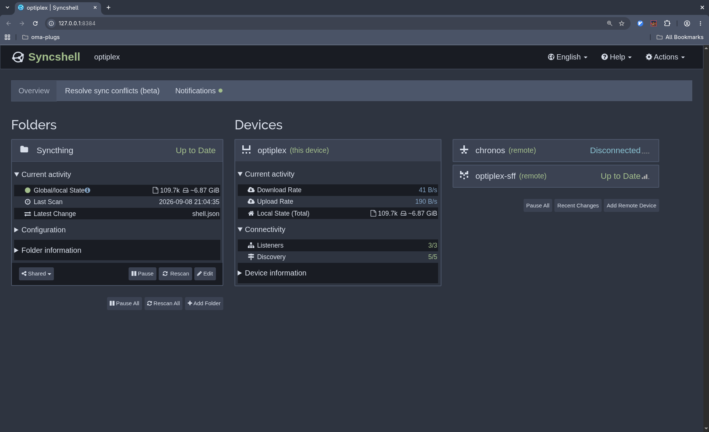
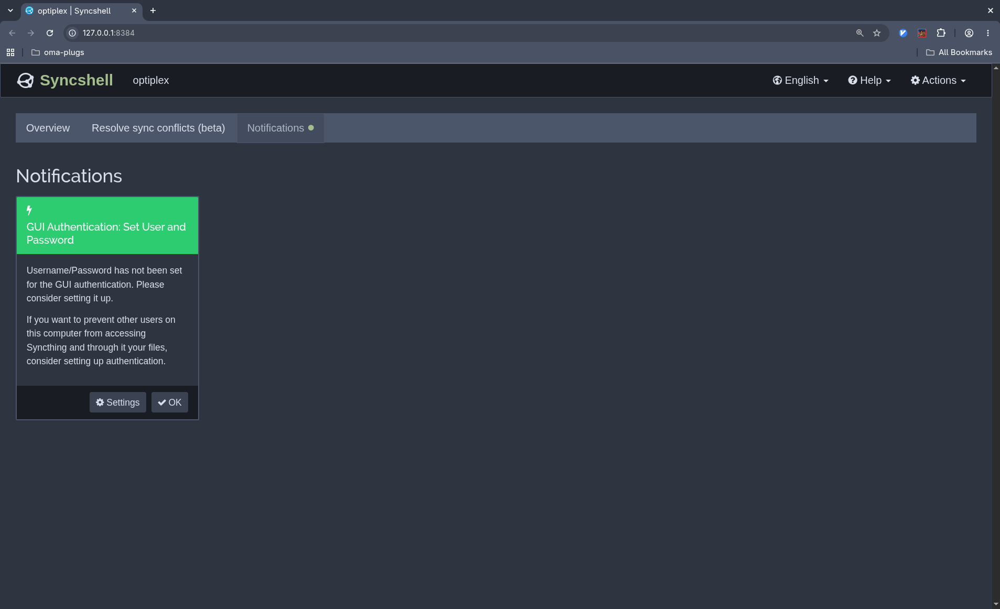
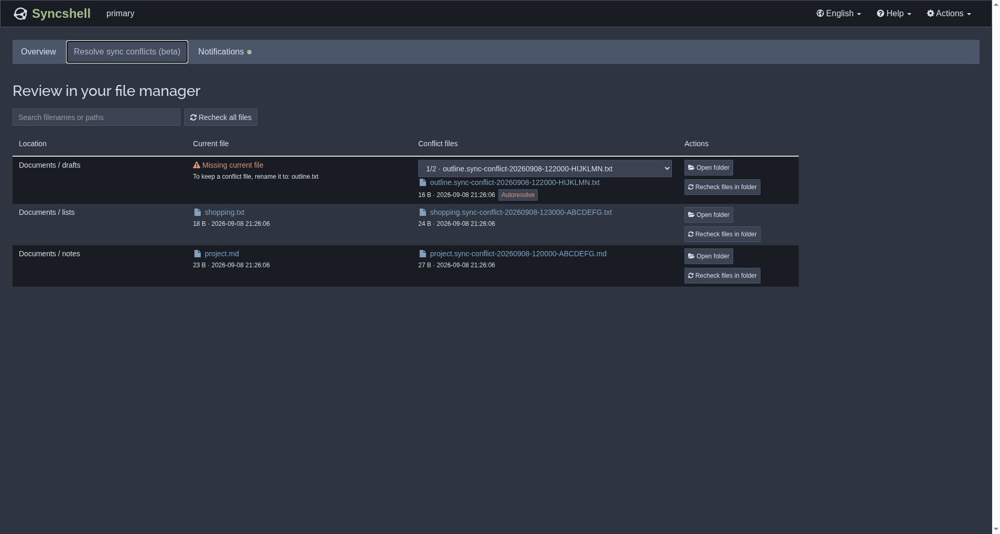
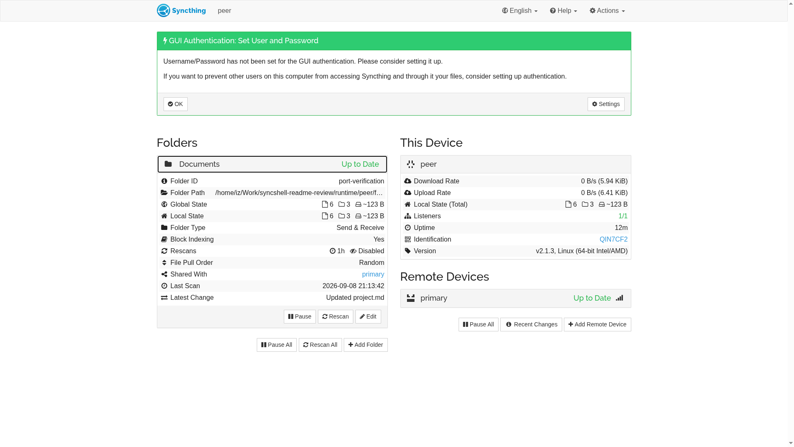

<h1 align="center">Syncshell = <strong>Sync</strong>thing + quick<strong>shell</strong></h1>

<p align="center">
  <a href="https://github.com/omarchy-QOL/syncshell/actions/workflows/test.yml"></a>
  <a href="core"></a>
  <a href="https://github.com/omarchy-QOL/syncshell/releases"></a>
  <a href="https://omarchy.org"></a>
  <a href="https://github.com/syncthing/syncthing/releases/tag/v2.1.3"></a>
  <a href="LICENSE"></a>
</p>

Syncshell shows [Syncthing](https://github.com/syncthing/syncthing) activity in
the Omarchy bar, manages local folders and opens a redesigned Web UI. Version
0.1.8 uses a bundled Go core. Other Linux shell adapters are planned.


## Quick start

- select the switch/toggle in the top right to start or stop the user service
- select a folder card to open its directory
- select **+** to configure an existing local directory
- select **RESCAN** on a folder or **Rescan all folders** for linked folders
- select **Web UI** for device setup and advanced folder options
- select the gear or press `s` for appearance settings and clean removal

## Install

```bash
omarchy plugin add https://github.com/omarchy-QOL/syncshell.git --enable
```

Open the widget and expand **More**. If Syncthing is missing, select **Install
Syncthing** to install the package and start the user service. Existing
installations are detected automatically.

Version 0.1.8 supports Omarchy on Linux x86_64 systems. Other host directories
are placeholders; other shells, ARM and daemon mode remain future work.

## Keybindings

Also shown in the panel footer.

| Key     | Action                    |
| ------- | ------------------------- |
| `r`     | rescan all folders        |
| `w`     | open the Web UI           |
| `p`     | start or stop the service |
| `s`     | open plugin settings      |
| `q/esc` | close the panel           |

## Settings

Settings opens `~/.config/omarchy/ilyazar.syncthing/settings.toml` in your
editor. Saves are validated; invalid edits show an error and leave the session's
last valid settings active.

Older settings offer **Auto-port**, **Manual port** and **Cancel**. Auto-port
previews the migration to schema `2`, preserves valid preferences and comments,
and keeps an exact backup beside the original. Unrecognized or invalid settings
need manual correction.

- `style.icon_style = "themed"` follows the bar foreground. Use `"branded"` for
  the classic Syncthing icon.
- `style.web_ui_theme = "default"` uses Syncthing's own Web UI.
- `style.web_ui_theme = "modern"` uses the bundled Syncshell Web UI.
- `style.web_ui_theme = "omarchy"` applies the Omarchy palette to that same UI.
  This is the default.

Omarchy theme changes apply live. Reload the page when switching Web UI
profiles; `modern` keeps its own appearance.

## Demo videos

Click a preview to play the video. These four walkthroughs cover live file
activity, folder management, Web UI theming, and plugin settings.

<!-- prettier-ignore -->
> [!WARNING]
> The Hyprland window to the left of the plugin is not part of the plugin. It
> live-tracks changes in the `test-source` directory for the demonstration.

<table>
  <tr>
    <td width="50%" valign="top">
      <a
        href="https://omarchy-qol.github.io/syncshell/assets/published/01_syncthing_file_activity.mp4"
      >
        
      </a>
      <p><strong>File activity</strong></p>
      <p>
        Copy and remove files while the panel reports live synchronization
        activity.
      </p>
    </td>
    <td width="50%" valign="top">
      <a
        href="https://omarchy-qol.github.io/syncshell/assets/published/02_syncthing_folder_lifecycle.mp4"
      >
        
      </a>
      <p><strong>Folder lifecycle</strong></p>
      <p>
        Unlink, relink, and forget a folder without deleting its local files.
      </p>
    </td>
  </tr>
  <tr>
    <td width="50%" valign="top">
      <a
        href="https://omarchy-qol.github.io/syncshell/assets/published/03_syncthing_theme_aware_webUI.mp4"
      >
        
      </a>
      <p><strong>Theme-aware Web UI</strong></p>
      <p>
        Follow Omarchy theme changes in Syncthing's Web UI without reloading.
      </p>
    </td>
    <td width="50%" valign="top">
      <a
        href="https://omarchy-qol.github.io/syncshell/assets/published/04_syncthing_icon_change_and_other_settings.mp4"
      >
        
      </a>
      <p><strong>Icon and settings</strong></p>
      <p>
        Switch the bar icon style and review the plugin's other settings.
      </p>
    </td>
  </tr>
</table>

### File activity

The plugin reports only state exposed by Syncthing:

- Blue identifies synchronization or an indexed addition.
- Red identifies an indexed entry with `deleted=true`.
- Green identifies remote download progress, which is an upload from this
  device.

Syncthing does not expose a reliable source-to-destination relationship for a
rename or move, so the plugin does not guess one from nearby additions and
deletions.

## New Web UI

The bundled UI keeps Syncthing's API and adds a few changes over the classical
interface:

- **Clearer layout:** folders, this device and remote devices sit alongside each
  other on wide screens and stack on smaller ones. Current activity stays
  visible; configuration and identification details fold away. Compact counts
  and icon tooltips keep the cards readable.
- **Resolve sync conflicts (beta):** the second tab lists conflict files from
  Syncthing's index, with folder and global rechecks. File links open the
  containing folder in your default file manager. Autoresolve restores a
  conflict file's original name when that name is absent, preserving contents.
- **Notifications:** a separate tab shows pending messages. Its dot follows the
  highest severity and disappears when all messages are resolved.
- **Smaller frontend:** The low-overhead and minimalist
  [Preact](https://github.com/preactjs/preact) replaces
  [AngularJS, whose support ended in 2022](https://angularjs.org/) and removes
  most of the old JavaScript widget libraries.

Compared with the default Web UI shipped with
[Syncthing v2.1.3](https://github.com/syncthing/syncthing/releases/tag/v2.1.3):

| Measure                        | Syncthing v2.1.3 | Syncshell | Reduction |
| ------------------------------ | ---------------- | --------- | --------- |
| Application source (LOC)       | 8,296            | 4,299     | 48%       |
| Readable source + vendor (LOC) | 53,096           | 9,885     | 81%       |
| HTML/CSS/JS assets             | 2.79 MB          | 0.33 MB   | 88%       |
| Whole Web UI assets            | 6.58 MB          | 0.48 MB   | 93%       |

Three Syncshell views in Nord, followed by Syncthing's default UI. The file
review is in beta, but should work more or less.

<table>
  <tr>
    <td width="50%" valign="top">
      <h4>Overview (Nord theme)</h4>
      <a href="assets/webui-nord-overview.png">
        
      </a>
    </td>
    <td width="50%" valign="top">
      <h4>Notifications (Nord theme)</h4>
      <a href="assets/webui-nord-notifications.png">
        
      </a>
    </td>
  </tr>
  <tr>
    <td width="50%" valign="top">
      <h4>Conflict review (Nord theme)</h4>
      <a href="assets/webui-nord-conflicts.png">
        
      </a>
    </td>
    <td width="50%" valign="top">
      <h4>Default Syncthing UI</h4>
      <a href="assets/webui-syncthing-default.png">
        
      </a>
    </td>
  </tr>
</table>

Open the UI through the plugin's **Web UI** button to enable local file opening
and renaming. These actions require Syncthing and the desktop to run as the same
user. Containers, tunnels, relative paths and symlinked paths are unsupported
for file actions; permission errors leave files unchanged. Discovery and
rechecks remain available without desktop access. Reopen through the plugin
after its core restarts.

Tested with Syncthing v2.1.3. Source history and licensing details are recorded
in [Syncshell Web provenance][webui-provenance].

## Manage folders from the panel

- **UNLINK / LINK** pause and resume a folder; they do not change its path or
  sharing.
- **FORGET** removes an unlinked folder from Syncthing's configuration while
  keeping its files.
- **Add** requires an existing directory and a unique Folder ID. Overlapping
  paths are rejected. Select remote devices explicitly to share the folder.

Incoming unencrypted folder offers can prefill the setup form. Use the Web UI
for encrypted sharing, untrusted devices and details beyond the panel's limits.
Shared folders need the same Folder ID on each device; accept an offer rather
than create a separate identity. See Syncthing's
[folder guide](https://docs.syncthing.net/intro/gui.html).

## Roadmap and prior releases

See [CHANGELOG.md](CHANGELOG.md) for details.

| Release | Date       | What changed                                            |
| ------- | ---------- | ------------------------------------------------------- |
| 0.1.9   | TBD        | syncshell-tui, syncshell-gui, check parity across UIs   |
|         |            | compatibility w/ caelestia, end4 illogical impulse, ... |
| 0.1.8   | TBD        | use one native core for the Omarchy panel               |
|         |            | support healthy externally managed Syncthing instances  |
|         |            | add the Preact Web UI and settings migration            |
|         |            | add conflict review (beta) and guarded file renaming    |
|         |            | improve error details, rescan feedback and recovery     |
|         |            | fix themed icon contrast, scaling and Web UI branding   |
| 0.1.7   | 2026-08-31 | fix persistent service-state reconciliation             |
|         |            | UI/UX: clear semantics on buttons, harmonize font size  |
| 0.1.6   | 2026-08-22 | make live and indexed file activity accurate            |
|         |            | refine folder lifecycle controls and pending offers     |
|         |            | add versioned icon and live Web UI theme settings       |
|         |            | refresh the preview and add four focused demo videos    |
| 0.1.5   | 2026-08-20 | add an optional theme-colored bar icon                  |
| 0.1.4   | 2026-08-16 | support TLS-enabled local Syncthing APIs                |
| 0.1.3   | 2026-08-15 | add a demo video and improve the documentation          |
| 0.1.2   | 2026-08-15 | manage Syncthing folders from the bar panel             |
| 0.1.1   | 2026-08-14 | monitor installs and show live synchronization activity |
| 0.1.0   | 2026-08-12 | first release                                           |

## Upgrade

Update through Omarchy, then restart the shell to load the updated plugin:

```bash
omarchy plugin update io.github.ilyazar.syncthing
omarchy-restart-shell
```

Restart the shell after updating; the retained old service may otherwise fail.
Syncshell does not restart it automatically.

## Remove

Select **Cleanly remove Syncthing plugin** in settings. You can keep or delete
plugin settings; both choices remove the custom Web UI profiles and restore
Syncthing's default UI. Syncthing itself, its configuration and synced files
remain intact.

To uninstall Syncthing separately:

```bash
systemctl --user disable --now syncthing.service
omarchy pkg drop syncthing
```

These commands leave Syncthing configuration and synchronized files intact.

## Security and license

The plugin runs as unsandboxed code under your desktop user. The Go core keeps
the Syncthing API key out of QML and plugin settings; that key permits changes
to Syncthing's configuration. File actions use your existing permissions.

Plugin code is MIT licensed. The Web UI and adapted icons retain Syncthing's
MPL-2.0 attribution and vendor licenses; see [Web UI
provenance][webui-provenance] and [icon sources](assets/README.md). The Go
runtime and system-call dependency use the
[BSD license](packaging/bundled/LICENSE.golang).

[webui-provenance]:
  https://github.com/syncshell/syncshell-webui/blob/main/UPSTREAM.md
