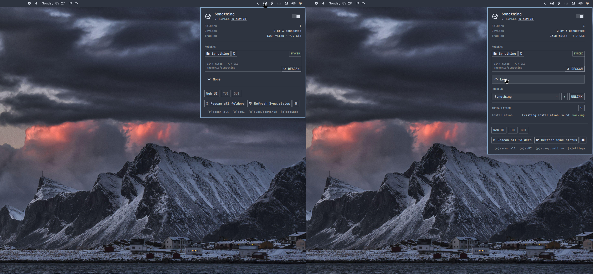

# Syncthing for Omarchy

Syncshell (**Sync**thing + quick**shell**) is a plugin to show Syncthing file
activity from the Omarchy bar. The plugin can manage local folders, open
Syncthing's Web UI, control the user service, and many more. Version 0.1.8 uses
one bundled native core while retaining Omarchy as the supported host. Other
shell adapters remain future work.



## Quick start

- select the switch/toggle in the top right to start or stop the user service
- select a folder card to open its directory
- select **+** to configure an existing local directory
- select **RESCAN** on a folder or **Rescan all folders** for linked folders
- select **Open Web UI** for device setup and advanced folder options
- select the gear or press `s` for appearance settings and clean removal

## Install

```bash
omarchy plugin add https://github.com/omarchy-QOL/syncshell.git --enable
```

Open the widget and expand **More**. If Syncthing is missing, select **Install
Syncthing**. The plugin runs `omarchy pkg add syncthing`, then enables and
starts `syncthing.service`. If Syncthing is already installed, the plugin should
auto-detect this. The native core retries from package status after a new
installation creates its first Syncthing configuration.

Syncshell 0.1.8 supports Linux x86_64 Omarchy systems. Its static native core is
bundled at `bin/x86_64/syncshell-core`; startup never downloads or builds an
executable and never falls back to `$PATH`. The reproducible build and SHA-256
verification scripts live under `packaging/bundled/`.

Omarchy is the only supported host in 0.1.8. The standalone surface is a
development contract harness. Caelestia, DankMaterialShell, Illogical Impulse,
Waybar, ARM, multiple instances, and a daemon mode remain unsupported future
work.

## Upgrade

Update through Omarchy, then restart the shell to load the updated plugin:

```bash
omarchy plugin update io.github.ilyazar.syncthing
omarchy-restart-shell
```

A shell restart is required after updating. Until then, Omarchy may retain
the previous service and plugin actions may fail. Plugin settings and bar
placement survive the ordinary update and restart. Syncshell does not restart
the shell automatically.

## Keybindings

As shown in the footer at the bottom of the main plugin menu

| Key   | Action                    |
| ----- | ------------------------- |
| `r`   | rescan all folders        |
| `w`   | open the Web UI           |
| `p`   | start or stop the service |
| `s`   | open plugin settings      |
| `q`   | close the panel           |
| `esc` | close the panel           |

## Settings

The settings menu opens `~/.config/omarchy/ilyazar.syncthing/settings.toml` in
the default editor. The file is created only when it is first opened, and
changes apply when saved. New files use configuration version `1`, with
appearance options grouped under the `[style]` section. Existing files are never
overwritten. Unknown additive sections are retained and ignored; unknown fields
inside the owned `[style]` and `[service]` sections remain validation errors.

- `style.icon_style = "branded"` uses the classic Syncthing bar icon. Use
  `themed` for an icon colored by the active Omarchy theme.
- `style.web_ui_theme = "omarchy"` applies the complete Omarchy palette to
  Syncthing's Web UI. Use `default` for Syncthing's own styling.

Changing the Omarchy theme regenerates the Web UI palette immediately. An open
Web UI applies the new colors without a page reload. The generated Omarchy theme
is separate from Syncthing's default theme assets, so selecting `default` keeps
Syncthing's styling and any user customization intact.

## Demo videos

Click a preview to play the video. These four walkthroughs cover live file
activity, folder management, Web UI theming, and plugin settings.

<!-- prettier-ignore -->
> [!WARNING]
> The Hyprland window to the left of the plugin is not part of the plugin. It
> live-tracks changes in the `test-source` directory for the demonstration.

<table>
  <tr>
    <td width="50%" valign="top">
      <a
        href="https://ilyazar.github.io/syncshell/assets/published/01_syncthing_file_activity.mp4"
      >
        
      </a>
      <p><strong>File activity</strong></p>
      <p>
        Copy and remove files while the panel reports live synchronization
        activity.
      </p>
    </td>
    <td width="50%" valign="top">
      <a
        href="https://ilyazar.github.io/syncshell/assets/published/02_syncthing_folder_lifecycle.mp4"
      >
        
      </a>
      <p><strong>Folder lifecycle</strong></p>
      <p>
        Unlink, relink, and forget a folder without deleting its local files.
      </p>
    </td>
  </tr>
  <tr>
    <td width="50%" valign="top">
      <a
        href="https://ilyazar.github.io/syncshell/assets/published/03_syncthing_theme_aware_webUI.mp4"
      >
        
      </a>
      <p><strong>Theme-aware Web UI</strong></p>
      <p>
        Follow Omarchy theme changes in Syncthing's Web UI without reloading.
      </p>
    </td>
    <td width="50%" valign="top">
      <a
        href="https://ilyazar.github.io/syncshell/assets/published/04_syncthing_icon_change_and_other_settings.mp4"
      >
        
      </a>
      <p><strong>Icon and settings</strong></p>
      <p>
        Switch the bar icon style and review the plugin's other settings.
      </p>
    </td>
  </tr>
</table>

### File activity

The plugin reports only state exposed by Syncthing:

- Blue identifies synchronization or an indexed addition.
- Red identifies an indexed entry with `deleted=true`.
- Green identifies remote download progress, which is an upload from this
  device.

Syncthing does not expose a reliable source-to-destination relationship for a
rename or move, so the plugin does not guess one from nearby additions and
deletions.

## Manage folders

**UNLINK** pauses the selected folder and **LINK** resumes it. Both actions use
Syncthing's reversible `paused` setting; they do not create filesystem links or
change device sharing.

**FORGET** is available for an unlinked folder. It removes that folder from the
local Syncthing configuration without deleting its directory or data. Its Folder
ID, settings, and device list are no longer retained by the plugin.

Adding a folder requires an existing directory and a unique Folder ID. The path
is canonicalized, and paths that duplicate, contain, or sit inside another
configured folder are rejected. A new folder is local-only unless remote devices
are explicitly selected.

Pending unencrypted folder offers can prefill the Folder ID, label, and offering
device. Encrypted offers and sharing with untrusted devices must be configured
in the Web UI.

Large collection bounds are explicit. If a configuration exceeds the panel's
bounded snapshot, the panel shows a warning and the Web UI remains available for
the omitted entries.

A shared folder must use the same Folder ID on every device. Labels and paths
may differ. Create the folder on one device, share it, and accept the offer on
the other devices rather than creating unrelated folder identities.

See Syncthing's
[Getting Started guide](https://docs.syncthing.net/intro/getting-started.html)
and [folder guide](https://docs.syncthing.net/intro/gui.html) for device pairing
and sharing.

Folder management and Web UI theming use Syncthing's granular configuration and
system-path APIs and require Syncthing 1.21.0 or later.

The current Web UI integration preserves the released Omarchy workflow. A
modernized Web UI belongs to a later shell release and is not part of 0.1.8.

## Roadmap and prior releases

Planned work stays at the top. Shipped entries come from
[CHANGELOG.md](CHANGELOG.md), newest first.

| Release | State     | Date       | What changed                                            |
| ------- | --------- | ---------- | ------------------------------------------------------- |
| 0.1.8   | candidate | TBD        | use one native core without changing the Omarchy panel  |
|         |           |            | support healthy externally managed Syncthing instances  |
| 0.1.7   | shipped   | 2026-08-31 | fix persistent service-state reconciliation             |
|         |           |            | UI/UX: clear semantics on buttons, harmonize font size  |
| 0.1.6   | shipped   | 2026-08-22 | make live and indexed file activity accurate            |
|         |           |            | refine folder lifecycle controls and pending offers     |
|         |           |            | add versioned icon and live Web UI theme settings       |
|         |           |            | refresh the preview and add four focused demo videos    |
| 0.1.5   | shipped   | 2026-08-20 | add an optional theme-colored bar icon                  |
| 0.1.4   | shipped   | 2026-08-16 | support TLS-enabled local Syncthing APIs                |
| 0.1.3   | shipped   | 2026-08-15 | add a demo video and improve the documentation          |
| 0.1.2   | shipped   | 2026-08-15 | manage Syncthing folders from the bar panel             |
| 0.1.1   | shipped   | 2026-08-14 | monitor installs and show live synchronization activity |
| 0.1.0   | shipped   | 2026-08-12 | first release                                           |

## Remove

Open the plugin settings and select **Cleanly remove Syncthing plugin**. The
confirmation can preserve or delete the plugin settings. Both choices restore
Syncthing's default Web UI when the Omarchy theme is active, remove the
generated Omarchy theme, and then use Omarchy's native plugin removal.

Clean plugin removal never uninstalls Syncthing or removes its configuration,
folders, devices, or synchronized data. Uninstall Syncthing separately only when
that is intended:

```bash
systemctl --user disable --now syncthing.service
omarchy pkg drop syncthing
```

These commands do not remove Syncthing configuration or synchronized files.

## Security and license

The native core talks to the selected Syncthing API. It discovers and keeps the
API key only in Go memory and never sends it through QML, JSONL, arguments,
settings, logs, fixtures, or screenshots. Like other Omarchy shell plugins, it
runs unsandboxed, and the API key permits Syncthing configuration changes.

If the panel reports that its native core is unavailable, verify that the
checkout contains the regular executable at `bin/x86_64/syncshell-core`, that
its mode is `0755`, and that the machine architecture is `x86_64`.
`packaging/bundled/verify.sh` checks the complete artifact contract.

Plugin code is MIT licensed. Adapted Syncthing status icons are MPL-2.0; their
source and attribution are documented in `assets/README.md`.
